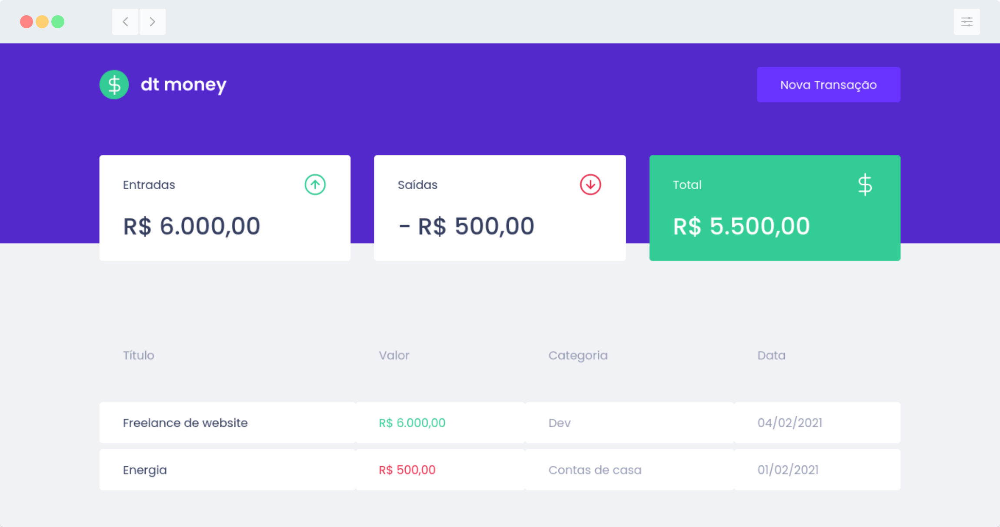

<p align="center"> </p>

## Primeira aplicação web com ReactJS

Aplicação front-end web completa utilizando conceitos e ferramentas importantes do ecossistema React como:

- Styled Components
- MirageJS
- Context API
- Hooks
- Axios

## Como Instalar
```bash
# clone o repositório
git clone https://github.com/sihann/dtmoney.git

# instale as dependencias
yarn

# rodar a aplicação
yarn start

``` 

## Licença
[MIT](https://github.com/sihann/dtmoney/blob/main/LICENSE)